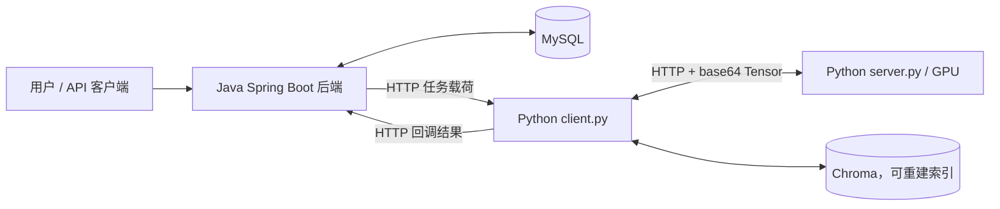

# CLIP 分布式检索服务

[English](README_EN.md) | [本地运行手册](docs/local-runbook.md) | [AutoDL 远程卸载实验](docs/autodl-experiment-guide.md)

这是一个以 **Java 后端为业务事实来源**、以 **Python CLIP 服务为推理执行层** 的图文检索项目。它支持本地推理，也支持通过 HTTP 将选定的 CLIP 组件卸载到远程 GPU 服务。

## 架构



职责边界：

- `CLIP_backend`：拥有用户、照片元数据、AI 任务、匹配结果和 embedding 元数据；MySQL 是这些业务数据的唯一事实来源。
- `CLIP_model/client.py`：接收后端任务、执行 CLIP 推理或将配置的组件卸载到远端、回写结构化结果。
- `CLIP_model/server.py`：仅承载远程 GPU 模型组件，不直接访问 MySQL 或 Java 业务表。
- Chroma：可删除并通过回填重建的向量索引，不是业务数据源。
- `CLIP_frontend`：遗留前端，当前后端优先重构阶段不在主要维护范围内。

所有模型通信使用 HTTP；本项目不启用 WebSocket 传输。

## 功能

- 分类任务、文本搜图、向量 embedding 回填。
- 任务状态与结果持久化：`ai_tasks`、`photo_description_matches`、`embedding_records`。
- 本地文件存储抽象：通过 `FileStorageService` 隔离存储实现。
- 多粒度远程卸载：完整编码器、编码器块、Attention、MLP、卷积、投影和余弦相似度。
- 每次推理独立日志：`logs/YYYY_MM_DD_<uuid>.log`，便于分析本地计算、远端计算和 HTTP RTT。
- 可选 Chroma 向量检索与 Prometheus 指标。

## 仓库结构

```text
CLIP/
├── CLIP_backend/          # Spring Boot + MyBatis + MySQL + 文件存储
│   ├── schema.sql         # 权威数据库 schema
│   └── Management/        # 后端应用模块
├── CLIP_model/            # Flask CLIP 推理与远程卸载服务
│   ├── client.py          # 后端任务入口 / 本地推理协调器
│   ├── server.py          # 远程 GPU 组件服务
│   ├── model/             # CLIP 模型与组件拆分
│   ├── manager/           # 任务、回调、向量与指标逻辑
│   ├── utils/             # 配置、计时、卸载和日志
│   └── requirements.txt   # Python 3.10 / CUDA 12.1 运行依赖
├── docs/
│   ├── local-runbook.md
│   └── autodl-experiment-guide.md
└── CLIP_frontend/         # 遗留前端
```

## 快速开始（本机）

### 前置条件

- JDK 23、Maven 3.8+
- MySQL 8/9
- Python 3.10
- 可选：CUDA PyTorch，用于 GPU 推理
- `CLIP_model/ViT-L-14.pt` 模型权重（不会通过 Git 提交）

### 1. 初始化数据库并启动后端

数据库 schema 的唯一来源是 `CLIP_backend/schema.sql`。

```powershell
cd D:\CLIP\CLIP_backend
$env:MYSQL_PASSWORD='<本地 MySQL 密码>'
mvn -q test
mvn -q -DskipTests package

cd .\Management
$env:MYSQL_HOST='127.0.0.1'
$env:AI_SERVICE_BASE_URL='http://localhost:5000'
java -jar .\target\Management-0.0.1-SNAPSHOT.jar
```

### 2. 安装并启动本机模型协调服务

```powershell
cd D:\CLIP\CLIP_model
D:\Anaconda\envs\CLIP\python.exe -m pip install -r requirements.txt
$env:BACKEND_BASE_URL='http://localhost:8080'
Remove-Item Env:\CLIP_SMOKE_MODE -ErrorAction SilentlyContinue
D:\Anaconda\envs\CLIP\python.exe client.py
```

检查：

```powershell
Invoke-RestMethod http://localhost:5000/health
```

当 CUDA 可用时，响应中的 `device` 应为 `cuda:0`。

## 远程 GPU 卸载

远端机器只启动 `CLIP_model/server.py`，本机继续运行 Java、MySQL 和 `client.py`。两端配置相同的 `OFFLOAD_TOKEN`，本机 `.env` 设置远端 `SERVER_IP`、`SERVER_PORT`，然后按实验目的开启所需的 `OFFLOAD_*` 开关。

```text
本机 client.py -- HTTP --> 远端 server.py（GPU）
```

性能实验应先运行所有 `OFFLOAD_*=false` 的本地基线，再逐步启用粗、中、细粒度卸载。重点比较：

- 端到端延迟（E2E）
- 远端 `infer_ms`
- 每个 RPC 的 RTT
- GPU 利用率与显存
- 单次预测触发的远程调用次数

完整操作、端口映射、依赖安装、日志读取和结果表模板见 [AutoDL 远程模型卸载实验操作文档](docs/autodl-experiment-guide.md)。

## 重要运行配置

| 配置 | 默认值 | 用途 |
|---|---:|---|
| `MYSQL_HOST` | `127.0.0.1` | Java 后端连接的 MySQL 地址 |
| `AI_SERVICE_BASE_URL` | `http://localhost:5000` | Java 后端访问本机 `client.py` 的地址 |
| `BACKEND_BASE_URL` | `http://localhost:8080` | Python 回调 Java 后端的地址 |
| `AI_CALLBACK_TOKEN` | 空 | Java 与 Python 回调共享令牌 |
| `OFFLOAD_TOKEN` | 空 | 本机 `client.py` 与远端 `server.py` 的共享令牌 |
| `CLIP_SMOKE_MODE` | `false` | 仅用于回调/数据库烟雾测试，不能用于真实性能或向量实验 |
| `VECTOR_STORE_ENABLED` | `true` | 是否启用 Chroma 图片向量索引 |

密钥只写入本机或服务器的 `.env`，绝不能提交到 Git。

## 验证

```powershell
cd D:\CLIP
D:\Anaconda\envs\CLIP\python.exe -m unittest discover -s CLIP_model\tests
D:\Anaconda\envs\CLIP\python.exe -m py_compile CLIP_model\client.py CLIP_model\server.py CLIP_model\utils\config.py CLIP_model\utils\pred.py CLIP_model\utils\embedding.py CLIP_model\manager\ai_task_payload.py CLIP_model\manager\backend_client.py CLIP_model\manager\vector_store.py CLIP_model\manager\vector_search.py

cd .\CLIP_backend
$env:MYSQL_PASSWORD='<本地 MySQL 密码>'
mvn -q test
mvn -q -DskipTests package
```

## 进一步文档

- [本地运行、API 联调与故障排查](docs/local-runbook.md)
- [AutoDL 远程卸载实验](docs/autodl-experiment-guide.md)
- [后端 API 联调指南](docs/apifox-debugging.md)
- [English README](README_EN.md)
