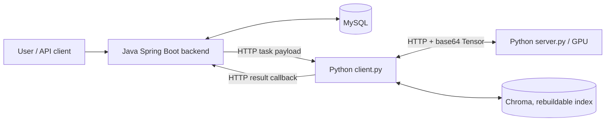

# CLIP Distributed Retrieval Service

[中文](README.md) | [Local Runbook](docs/local-runbook.md) | [AutoDL Remote-Offload Experiments](docs/autodl-experiment-guide.md)

This project is an image-text retrieval service with the **Java backend as the source of truth** and the **Python CLIP service as the inference layer**. It supports local inference and HTTP-based offloading of selected CLIP components to a remote GPU server.

## Architecture



Responsibilities are intentionally separated:

- `CLIP_backend` owns users, photo metadata, AI tasks, match results, and embedding metadata. MySQL is the sole source of truth for these business records.
- `CLIP_model/client.py` receives backend tasks, runs CLIP inference or offloads configured components, and posts structured results back to the backend.
- `CLIP_model/server.py` hosts remote GPU model components only. It never writes to MySQL or Java-owned business tables.
- Chroma is a rebuildable vector index, not a business-data source.
- `CLIP_frontend` is legacy code and outside the current backend-first refactor scope.

All model communication uses HTTP. WebSocket transport is not enabled.

## Features

- Category matching, text-to-image search, and embedding backfill.
- Persisted task state and results through `ai_tasks`, `photo_description_matches`, and `embedding_records`.
- Storage abstraction through `FileStorageService`.
- Multi-granularity remote offloading: complete encoders, encoder blocks, attention, MLP, convolution, projections, and cosine similarity.
- One log file per inference: `logs/YYYY_MM_DD_<uuid>.log`, useful for correlating local compute, remote compute, and HTTP RTT.
- Optional Chroma vector search and Prometheus metrics.

## Repository layout

```text
CLIP/
├── CLIP_backend/          # Spring Boot + MyBatis + MySQL + file storage
│   ├── schema.sql         # Canonical database schema
│   └── Management/        # Backend application module
├── CLIP_model/            # Flask CLIP inference and remote offloading
│   ├── client.py          # Backend task entry point / local coordinator
│   ├── server.py          # Remote GPU component service
│   ├── model/             # CLIP model and component decomposition
│   ├── manager/           # Tasks, callbacks, vectors, and metrics
│   ├── utils/             # Configuration, timing, offloading, and logs
│   └── requirements.txt   # Python 3.10 / CUDA 12.1 runtime dependencies
├── docs/
│   ├── local-runbook.md
│   └── autodl-experiment-guide.md
└── CLIP_frontend/         # Legacy frontend
```

## Quick start: local machine

### Prerequisites

- JDK 23 and Maven 3.8+
- MySQL 8/9
- Python 3.10
- Optional CUDA-enabled PyTorch for GPU inference
- `CLIP_model/ViT-L-14.pt` model weights (not committed to Git)

### 1. Initialize the database and start the backend

`CLIP_backend/schema.sql` is the canonical database schema.

```powershell
cd D:\CLIP\CLIP_backend
$env:MYSQL_PASSWORD='<local MySQL password>'
mvn -q test
mvn -q -DskipTests package

cd .\Management
$env:MYSQL_HOST='127.0.0.1'
$env:AI_SERVICE_BASE_URL='http://localhost:5000'
java -jar .\target\Management-0.0.1-SNAPSHOT.jar
```

### 2. Install and start the local model coordinator

```powershell
cd D:\CLIP\CLIP_model
D:\Anaconda\envs\CLIP\python.exe -m pip install -r requirements.txt
$env:BACKEND_BASE_URL='http://localhost:8080'
Remove-Item Env:\CLIP_SMOKE_MODE -ErrorAction SilentlyContinue
D:\Anaconda\envs\CLIP\python.exe client.py
```

Verify the service:

```powershell
Invoke-RestMethod http://localhost:5000/health
```

When CUDA is available, `device` should be `cuda:0`.

## Remote GPU offloading

Run only `CLIP_model/server.py` on the remote host. Java, MySQL, and `client.py` remain local. Configure the same `OFFLOAD_TOKEN` on both machines; on the local machine, set the remote `SERVER_IP` and `SERVER_PORT`, then enable the required `OFFLOAD_*` flags.

```text
local client.py -- HTTP --> remote server.py (GPU)
```

For performance experiments, first measure a local baseline with every `OFFLOAD_*=false`, then enable coarse-, medium-, and fine-grained offloading one configuration at a time. Focus on:

- End-to-end latency (E2E)
- Remote `infer_ms`
- RTT for each RPC
- GPU utilization and memory
- Number of remote calls per prediction

See the [AutoDL remote-offload experiment guide](docs/autodl-experiment-guide.md) for ports, dependencies, logs, and result templates.

## Important configuration

| Setting | Default | Purpose |
|---|---:|---|
| `MYSQL_HOST` | `127.0.0.1` | MySQL address used by the Java backend |
| `AI_SERVICE_BASE_URL` | `http://localhost:5000` | Local `client.py` address used by the Java backend |
| `BACKEND_BASE_URL` | `http://localhost:8080` | Java backend callback address used by Python |
| `AI_CALLBACK_TOKEN` | empty | Shared callback token between Java and Python |
| `OFFLOAD_TOKEN` | empty | Shared token between local `client.py` and remote `server.py` |
| `CLIP_SMOKE_MODE` | `false` | Callback/database smoke testing only; never use it for real performance or vector experiments |
| `VECTOR_STORE_ENABLED` | `true` | Enables the Chroma image-vector index |

Keep secrets in local or remote `.env` files only; never commit them to Git.

## Verification

```powershell
cd D:\CLIP
D:\Anaconda\envs\CLIP\python.exe -m unittest discover -s CLIP_model\tests
D:\Anaconda\envs\CLIP\python.exe -m py_compile CLIP_model\client.py CLIP_model\server.py CLIP_model\utils\config.py CLIP_model\utils\pred.py CLIP_model\utils\embedding.py CLIP_model\manager\ai_task_payload.py CLIP_model\manager\backend_client.py CLIP_model\manager\vector_store.py CLIP_model\manager\vector_search.py

cd .\CLIP_backend
$env:MYSQL_PASSWORD='<local MySQL password>'
mvn -q test
mvn -q -DskipTests package
```

## Further documentation

- [Local startup, API integration, and troubleshooting](docs/local-runbook.md)
- [AutoDL remote-offload experiments](docs/autodl-experiment-guide.md)
- [Backend API debugging guide](docs/apifox-debugging.md)
- [中文版 README](README.md)
